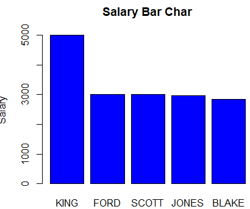
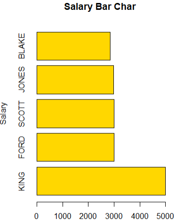
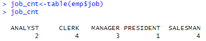
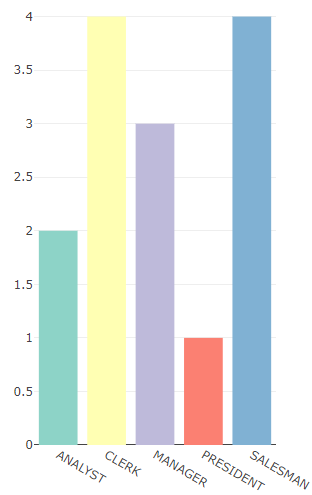

# 1️⃣막대 그래프
### 📍Code1. R에 내장된 함수를 이용한 막대 그래프 

```r
barplot(emp$sal,
        main = 'Salary Bar Char',
        names.arg=emp$ename,
        ylab='Salary',
        col='blue'
	)
```


```r
barplot(emp$sal,
        main = 'Salary Bar Char',
        names.arg=emp$ename,
        ylab='Salary',
        col='gold',
        horiz=TRUE)
```


&nbsp;

### 📍Code2. plotly를 이용한 막대 그래프

```r
#패키지 부착
install.packages('plotly')
library(plotly)

#직업별 인원수 계산
job_counts<-table(emp$job)

#RColorBrewer 팔레트 중에서 5가지 색상 선택
install.packages("RColorBrewer")
library(RColorBrewer)
colors<-brewer.pal(5,'Set3')

#plotly를 사용한 막대 그래프 생성
fig<-plot_ly(x=names(job_counts),
	     y=as.numeric(job_counts),
	     type='bar',
	     marker=list(color=colors)
             )

#그래프 출력
fig
```



&nbsp;
