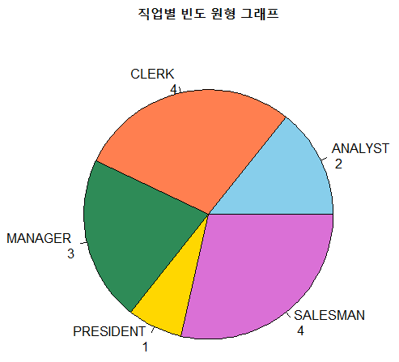
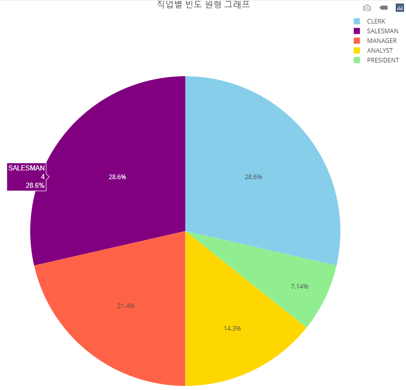
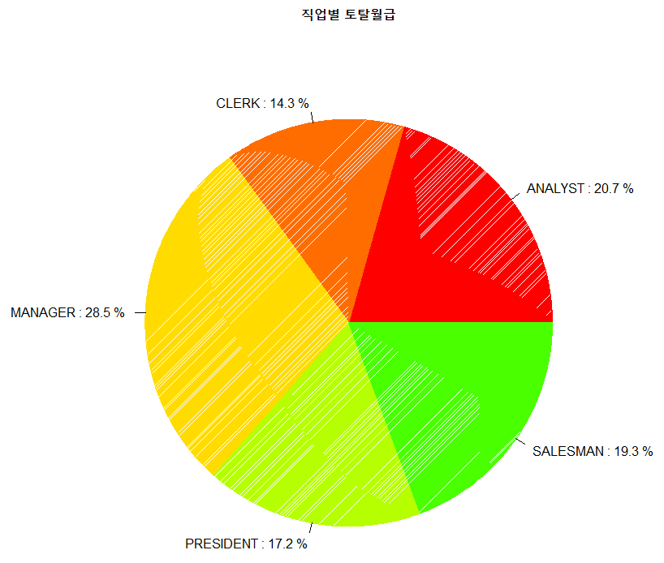
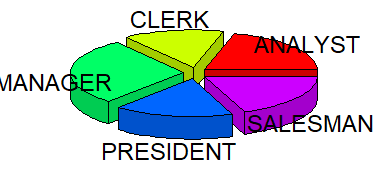

# 2️⃣원형 그래프

### 📍Code1. R 내장 함수를 이용한 원형 그래프

```r
job_cnt <- table(emp$job)

colors <- c("skyblue", "coral", "seagreen", "gold", "orchid")

pie( job_cnt, 
     main="직업별 빈도 원형 그래프" ,
     col= colors,
     labels= paste(names(job_cnt), "\n", job_cnt ) )
```


&nbsp;

### 📍Code2. plotly로 원형 그래프 그리기
```r
#패키지 부착
library(plotly)

#직업별 인원수 계산
job_cnt <- table(emp$job)

#색상 목록 정의
colors <- c('gold','skyblue','tomato','lightgreen','purple')

#plotly를 사용한 원형 그래프 생성
fig <- plot_ly ( labels=names(job_cnt),
		 values=as.numeric(job_cnt),
		 type='pie',
		 marker=list(colors=colors) )

#그래프 제목 추가
fig <- fig %>% layout(title = "직업별 빈도 원형 그래프")
									
#그래프 출력
fig 								
```


&nbsp;

### 📍Code3. 비율 표시하는 label 붙이기_직업별 토탈월급
```r
#가로출력
x <- tapply( emp$sal, emp$job, sum )

#비율 구해서 job_label 생성
x2 <- aggregate(sal~job, emp, sum)
pct <- round(x2$sal / sum(emp$sal) * 100, 1)
job_label <- paste(x2$job, ':', pct, '%')
job_label

#그래프 출력
pie( x,
     main="직업별 토탈월급",
     labels=job_label,
     col=rainbow(14),
     density=500 ) 
```



&nbsp;

### 📍Code4. plotrix로 3D 원형그래프 그리기
```r
#패키지 부착
install.packages("plotrix")
library(plotrix)

#가로출력
x <- tapply( emp$sal, emp$job, sum )

#그래프 생성
pie3D( x, explode=0.1, labels=rownames(x) )  # explode -> 벌어진 정도  
```


&nbsp;

