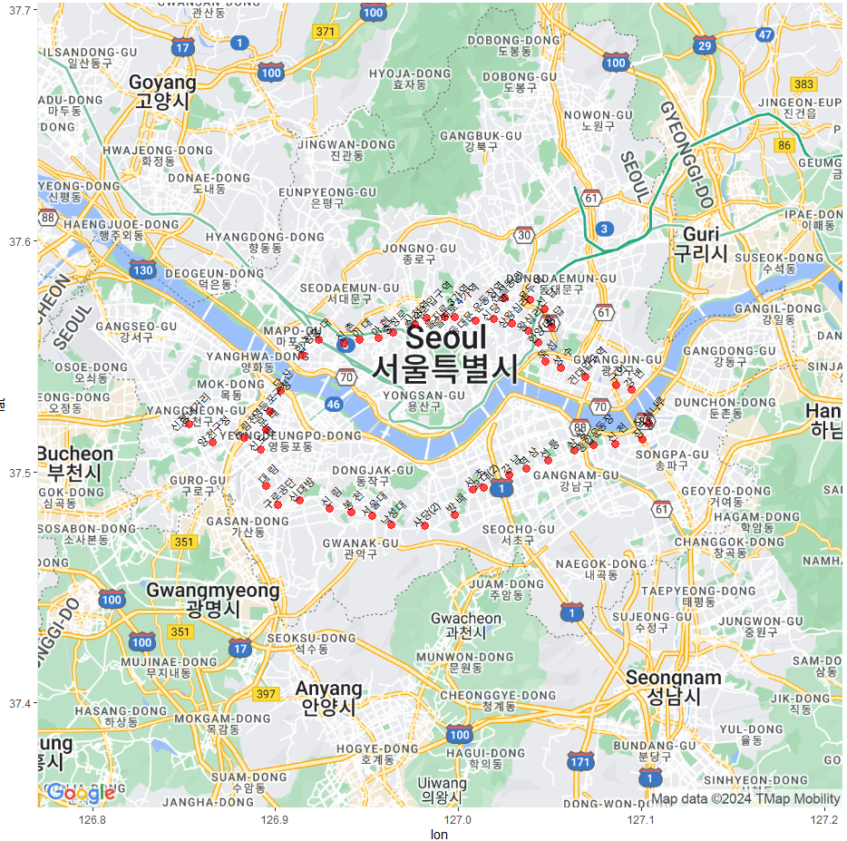
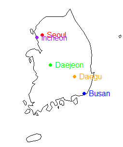

# 8️⃣지도 그래프  
### 📍Code1. ggmap패키지_구글 지도~서울
```r
# 필요한 패키지 설치
install.packages("ggplot2")
install.packages("ggmap")  # 구글 지도 데이터를 시각화 하기 위한 패키지
			   # 구글 api 이용해야 사용 가능 

# 패키지 로드
library(ggplot2)
library(ggmap)

# 구글 API 키 등록
register_google(key = "구글 지도 API 키")
# maps static api도 활성화 필요 ! 

# 데이터 로드 (서울 지하철 2호선 위경도 정보 파일 경로를 정확히 지정)
# 2호선 역의 위도와 경도 정보를 가지고 동그라미 표시를 위해 
loc <- read.csv("서울지하철2호선위경도정보.csv", header = TRUE,  fileEncoding ="euc-kr" )

# 중심점 계산
center <- c(mean(loc$LON), mean(loc$LAT))

# 구글 지도 가져오기
kor <- get_map(location = center, zoom = 11, maptype = "roadmap")
ggmap(kor)

# 지도 시각화
kor.map <- ggmap(kor) + 
  geom_point(data = loc, aes(x = LON, y = LAT), size = 3, alpha = 0.7) +  #alpha : 투명도 
  geom_text(data = loc, aes(x = LON, y = LAT + 0.005, label = 역명), size = 3)

# 지도 출력
print(kor.map)
```

&nbsp;


### 📍Code2. 구글 서울 지도에 2호선 라인 표시
```r
# 필요한 패키지 설치
install.packages("ggplot2")
install.packages("ggmap") # 구글 지도 데이터를 시각화 하기 위한 패키지
			  # 구글 api 이용해야 사용 가능 

# 패키지 로드
library(ggplot2)
library(ggmap)

# 구글 API 키 등록
register_google(key = "구글 지도 API 키") 

# 데이터 로드 (서울 지하철 2호선 위경도 정보 파일 경로를 정확히 지정)
# 2호선 역의 위도와 경도 정보를 가지고 동그라미 표시를 위해 
loc <- read.csv("서울지하철2호선위경도정보.csv", header = TRUE,  fileEncoding ="euc-kr" )

# 중심점 계산
center <- c(mean(loc$LON), mean(loc$LAT))

# 구글 지도 가져오기
kor <- get_map(location = center, zoom = 11, maptype = "roadmap")
ggmap(kor)

# 지도 시각화
kor.map <- ggmap(kor) + 
  geom_point(data = loc, aes(x = LON, y = LAT), size = 3, alpha = 0.7, col="red") +
  geom_text(data = loc, aes(x = LON, y = LAT + 0.005, label = 역명), size = 3, angle=45 ) 
#alpha : 투명도
#angle : 역이름 기울기

# 지도 출력
print(kor.map)
```



&nbsp;


### 📍Code3. R의 내장된 지도 함수를 이용하기
**▪️ Q1. 시계지도 출력하기**
```r
install.packages("maps")
install.packages("mapproj")

library(maps)
library(mapproj)

map("world")
```

&nbsp;

**▪ Q2. 한국지도 시각화**  
```r
# 한국 지도에 사용자 정의 색상 및 테마 적용
map("world", "south korea", fill=TRUE, col="lightblue", bg="lightgray")

# 한국 지도에서 특정 영역만 확대해서 보기 (경도, 위도 범위 설정)
map("world", "south korea", xlim=c(125, 131), ylim=c(33, 39))

# 기본 한국 지도
map("world", "south korea")

# 주요 도시 표시
points(126.9780, 37.5665, col="red", pch=19) # 서울 위치
text(126.9780, 37.5665, "Seoul", pos=4, col="red")

points(129.0756, 35.1796, col="blue", pch=19) # 부산 위치
text(129.0756, 35.1796, "Busan", pos=4, col="blue")

points(127.3845, 36.3504, col="green", pch=19) # 대전 위치
text(127.3845, 36.3504, "Daejeon", pos=4, col="green")

points(126.7052, 37.4563, col="purple", pch=19) # 인천 위치
text(126.7052, 37.4563, "Incheon", pos=4, col="purple")

points(128.6014, 35.8714, col="orange", pch=19) # 대구 위치
text(128.6014, 35.8714, "Daegu", pos=4, col="orange")

# 한국 지도에 사용자 정의 색상 및 테마 적용
map("world", "south korea", fill=TRUE, col="lightblue", bg="lightgray")
```




&nbsp;


### ✅ 지도 그래프를 시각화 해야하는 이유 ?

1. **공공 정책 및 행정**  
    ex. 범죄 지도, 선거 결과 분석, 교통 관리, 도시 계획 등에서 지리적 데이터를 이용해서 정책 결정을 지원   
    범죄 발생지도를 통해 경찰 순찰 경로를 최적화 하거나, 교통 혼잡 지역을 분석하여 교통 신호 체계를 개선할 수 있다.    
    
2. **건강과 질병**    
    질병 발생 지도, 전염병 확산 경로 분석을 통해 공중 보건 전략을 수립    
   
3. **마케팅 및 소매업**    
    고객분포 분석, 상권 분석, 지점 위치 등을 최적화 할 때 사용     
    ex. sk telecom에서 기지국 세울 때 적절한 곳에 기지국을 만들어야 할 때 활용    
   ( 지도 그래프, 비지도 학습의 k-means 머신러닝 )    
    
5. **물류 및 공급망 관리**    
    쿠팡의 경우 최적의 물류 경로 최적화, 창고 위치 선정, 배송 경로 조회 등을 통해 운영의 효율성을 높임     

   

