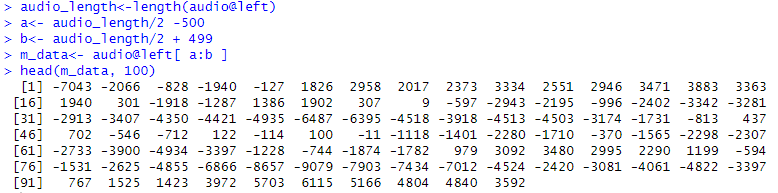
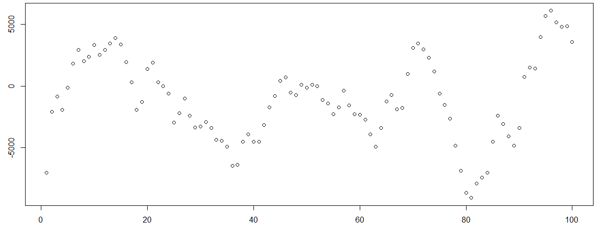
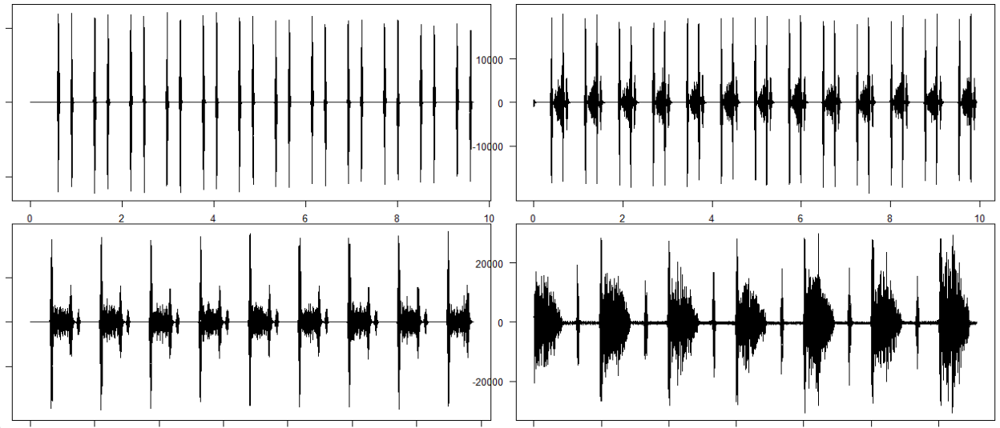
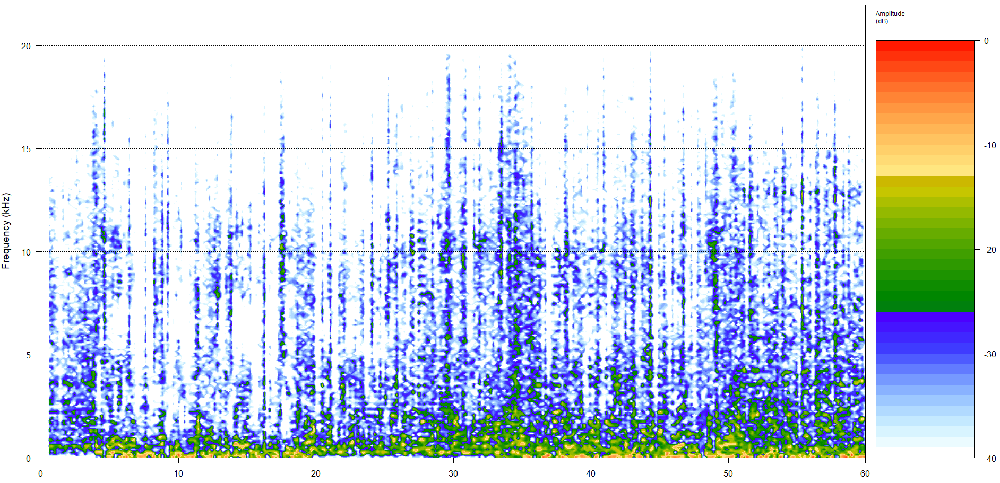

# 9️⃣소리 데이터 시각화
### 📍Code1. R로 음악소리 시각화(so hot)
```r
install.packages("tuneR")
library(tuneR)

setwd("c:\\data")
audio<- readWave("sohot_trimmed.wav")

head(audio@left, 1000)

audio_length<-length(audio@left)
a<- audio_length/2 -500
b<- audio_length/2 + 499

m_data<- audio@left[ a:b ]

c<- head(m_data, 100) 
```



```r
plot(c)
```



&nbsp;


### 📍Code2. 정상적인 심장박동 소리와 질환이 있는 심장박동 소리를 각각 시각화

```r
audio1<- readWave("normal.wav")
audio2<- readWave("ps.wav")
audio3<- readWave("mr.wav")
audio4<- readWave("ar.wav")

play(audio1)
play(audio2)
play(audio3)
play(audio4)

graphics.off()            # 그래프를 화면에서 지우기 
par(mfrow=c(2,2), new=T)  # 2행 2열로 그래프를 그려라 
par(mar=c(1,1,1,1))       # 여백의 길이를 지정 (좌우상하) 
plot(audio1)
plot(audio2)
plot(audio3)
plot(audio4)              # 한 번에 드래그해서 출력해야 함 
```



&nbsp;


### 📍Code3. 소리를 주파수 스펙트럼 프리즘에 넣어서 주파수 스펙트럼 만들기_after like
```r
소리 —> 숫자 (소리 증폭) —> 주파수 스펙트럼 프리즘 —> 주파수 스펙트럼 
```
```r
#####1. mp3를 wav로 변환
# MP3 파일을 WAV 파일로 변환
install.packages("tuneR")
install.packages("av")

library(tuneR)
library(av)

# 파일 경로 설정
mp3_file <- "c:\\data\\afterlike.mp3"
wav_file <- "c:\\data\\afterlike.wav"

# MP3 파일을 WAV 파일로 변환
av_audio_convert(mp3_file, wav_file)

# 변환된 파일을 확인
if (file.exists(wav_file)) {
  cat("변환이 성공적으로 완료되었습니다:", wav_file, "\n")
} else {
  cat("변환에 실패했습니다.\n")
}

#####2. wav 파일의 크기를 작게 자르는 작업
# 1. 앞부분만 잘라내기
# 필요한 패키지 설치 및 로드
install.packages("tuneR")
library(tuneR)

# 음성 파일을 읽어옴
file_path <- "afterlike.wav"
sample_wave <- readWave(file_path)

# 음성 신호와 샘플링 속도 추출
audio_samples <- sample_wave@left
sample_rate <- sample_wave@samp.rate

# 1분(60초)에 해당하는 샘플 수 계산
duration_sec <- 60  # 1분 = 60초
num_samples <- duration_sec * sample_rate

# 앞부분 1분의 음원만 잘라내기
if (num_samples > length(audio_samples)) {
  stop("The file is shorter than 1 minute.")
}
trimmed_samples <- audio_samples[1:num_samples]

# 새로운 Wave 객체 생성
trimmed_wave <- Wave(left = trimmed_samples, samp.rate = sample_rate, bit = sample_wave@bit)

# 새로운 파일로 저장
writeWave(trimmed_wave, "afterlike_trimmed.wav")

# 결과 확인
cat("The first 1 minute of the audio has been trimmed and saved as 'afterlike_trimmed.wav'\n")

#####3. wav를 주파수 스펙트럼으로 변환, 시각화
# 필요한 패키지 설치 및 로드
install.packages("tuneR")
install.packages("seewave")

library(tuneR)
library(seewave)

# 음성 파일을 읽어옴
sample_wave <- readWave("afterlike_trimmed.wav")

# 음성 신호와 샘플링 속도 추출
audio_samples <- sample_wave@left
sample_rate <- sample_wave@samp.rate

# 주파수 스펙트럼 계산 및 시각화
par(mfrow = c(1, 1))  # 그래프를 1x1 배치로 설정
spectro(audio_samples,fastdisp=TRUE, f = sample_rate, ovlp = 50, collevels = seq(-40, 0, 1))

#audio_samples <- 분석할 소리
#fastdisp <- 빠른 디스플레이 모드를 사용. 그래프를 더 빠르게 랜더링 하겠다.
#f=sample_rate <- 샘플링 주파수를 설정합니다.
#ovlp = 50 <- 오버랩을 50% 겹치게 해서 스펙트럼의 시간 해상도를 높이게 해줌
#collevels = seq(-40, 0, 1) 
#└색상 지정하기 -40db ~ 0db까지 1db 간격으로 색상 레벨을 지정 하겠다. 
```


**<그래프 설명>**  
1. 가로축: 시간 0~ 60초   
2. 세로축: 주파수 ( 0 khz ~ 20khz)   
3. 색상 : 신호의 진폭. 오른쪽에 있는 것-색상 눈금, 빨간색이 가장 높은 진폭 , 
          파란 색이 가장 낮은 진폭, 중간 색상이 중간 진폭 

&nbsp;


### ✅ 소리 데이터 분석이 활용되는 분야
1. 건강 및 의료   
    심장소리, 폐 소리등의 분석을 통해 심장병, 폐질환을 진단하는데 사용됩니다.   
2. 보안 및 감시  
    보안 시스템에서 특정 소리(유리가 깨지는 소리)를 감지하여 침입을 탐지  
3. 음성 및 음악 처리  
    - 음악 스트리밍 서비스에서 사용자의 취향을 분석하여 맞춤형 음악을 제작하거나 추천하는데 활용   
    - 펫펄스랩. 반려견과 교감을 나눌 수 있는 디바이스를 만드는데 활용

